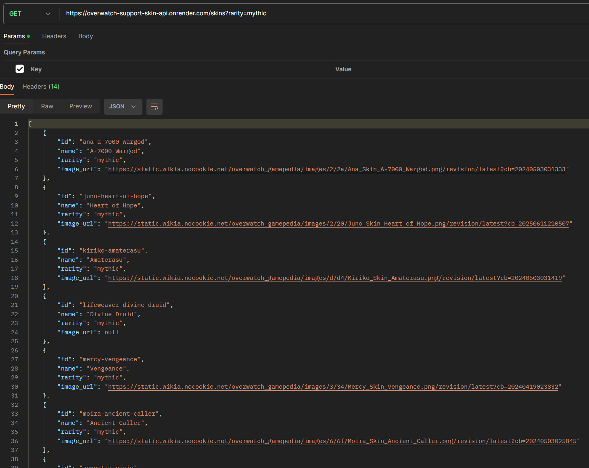

# Overwatch Support Skins API
#### A public API that provides structured, queryable data for Overwatch 2 support heroes and their skins. Built with TypeScript + Express, this project was designed as both a learning exercise and a portfolio piece to showcase API design, error handling, and various backend skills.

## Usage

Base URL is https://overwatch-support-skin-api.onrender.com

* `/heroes` → list all heroes
* `/heroes/:id` → details for a specific hero
    * Example:  `/heroes/kiriko`
* `/heroes/:id/skins` → all skins for a specific hero
    * Example: `/heroes/ana/skins`
* `/heroes/:id/skins?rarity=legendary` → filter for a specific hero’s skins by rarity
    * Example: `/heroes/ana/skins?rarity=mythic`
* `/skins` → all skins for all heroes
* `/skins?rarity=common` → all skins filtered by rarity

## Stack

* __Node.js + Express__ — API framework and Backend
* __Typescript__ — type Safety and maintainability
* __pnpm__ — fast package management
* __Render__ — free tier deployment, _sorry about the spin-up delay!!_
* __Postman__ - endpoint testing

## Motivation

I built this project to:
* Strengthen my skills in __RESTful API__ design and __TypeScript__.
* Create a web scraping → data normalization → usable, developer friendly API pipeline.
* Deploy a resume‑ready project that demonstrates real‑world backend development.
* Inspire other developers to build passion projects that support their favorite hobbies

## Process

1. I began by looking up the overwatch wiki where all the characters and skins are listed. Instead of typing in all of that json manually, I fetched the page with axios and parsed the html with cheerio.

2. I scraped the page for each character's cosmetics and cleaned the data using regex, then added it to an array. Finally I asyncronously exported that to a json file on my local machine.

3. To develop the API I used a lightweight Express.js setup, pnpm, and a basic typescript config. I added some custom types to double check my data's formatting.

4. I then imported the data and filter it using javascript array methods to serve the GET requests at my endpoints found in index.ts

5. Tested all endpoints locally with Postman.

6. Deployed to render's free tier.

## Challenges

Getting clean, usable data in the format I wanted without having to do it manually was a challenge I didn't have much experience with prior to this project. By using higher order javascript functions and tight regex, I was able to overcome this hurdle and obtain a clean JSON file for my API to use.

## Future Plans

With the rate overwatch releases skins, even keeping this API current could prove trying. I will strive to do so on my own time, and hopefully other devs can follow my lead and create a similar project for the rest of the roster!

## License

MIT License — free to use and adapt.

## Code Snippets

#### filter skins for a specific hero by rarity
```ts
app.get('/heroes/:id/skins', (req, res) => {
    const heroId = req.params.id;
    const hero = data.find((h) => h.id === heroId)
        if (!hero) {
        return res.status(404).json( {error: 'Hero not found'})
    }
    const rarity = req.query.rarity;

    let skins = hero.skins;
    if (rarity && typeof rarity === 'string') {
        skins = skins.filter((skin) => skin.rarity.toLowerCase() === rarity)
    }

    if (skins.length === 0) {
        return res.status(404).json ( {message: `No ${rarity} skins found for ${hero}`})
    }

    res.json(skins)

})
```

#### sample response for `heroes/ana/skins?rarity=epic`
```json
[
    {
        "id": "ana-merciful",
        "name": "Merciful",
        "rarity": "epic",
        "image_url": "https://static.wikia.nocookie.net/overwatch_gamepedia/images/4/4f/Ana_Skin_Merciful.png/revision/latest?cb=20240330130047"
    },
    {
        "id": "ana-shrike",
        "name": "Shrike",
        "rarity": "epic",
        "image_url": "https://static.wikia.nocookie.net/overwatch_gamepedia/images/7/7f/Ana_Skin_Shrike.png/revision/latest?cb=20240330130724"
    },
    {
        "id": "ana-tal",
        "name": "Tal",
        "rarity": "epic",
        "image_url": "https://static.wikia.nocookie.net/overwatch_gamepedia/images/e/eb/Ana_Skin_Tal.png/revision/latest?cb=20240330130919"
    },
]
```
## Postman Demo
##### Postman demo of JSON response requesting all mythic skins

